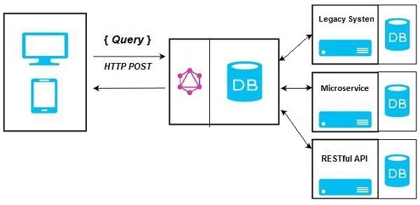

# README

REF: https://www.tutorialspoint.com/graphql/index.htm

## Body request : http://localhost:3000/graphiql

Example

```
{
   test
   greeting
   students {
      id
      firstName
      lastName
   }
   studentById(id:"S1002") {
      id
      firstName
      lastName
   }
}
```

## Architecture

### GraphQL Server with Connected Database


### GraphQL Server Integrating Existing Systems


### Hybrid Approach


